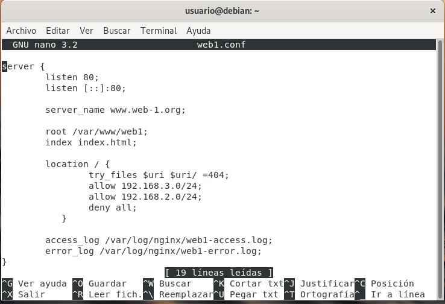
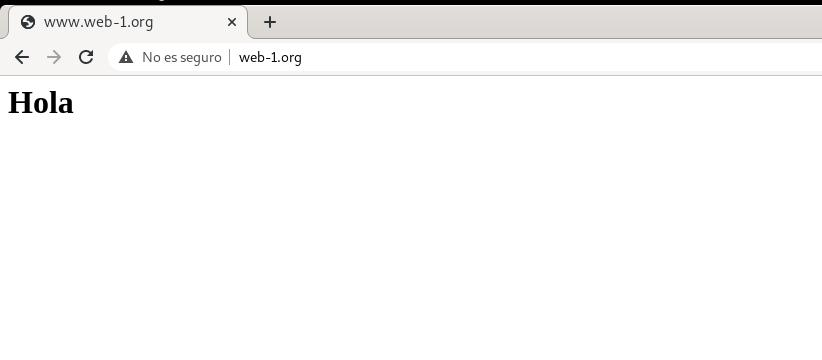
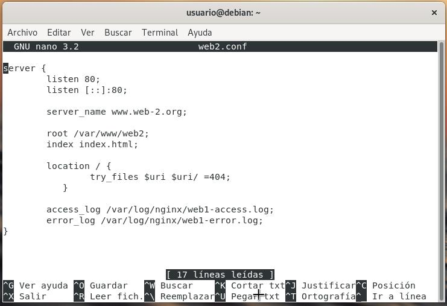
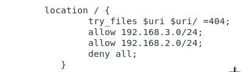

# NGINX
## Introducción
#### ¿ Que es Nginx ?
Es un servidor web/proxy inverso ligero de alto rendimiento y un proxy para protocolos de correo electrónico.Es software libre y de código abierto, licenciado bajo la Licencia BSD simplificada; también existe una versión comercial distribuida bajo el nombre de Nginx Plus.
## Indice
1. [Nginx vs Apache](#comparativa)
2. [Esquema de Red](#esquema)
3. [Instalacion](#instalacion)
4. [Casos practicos](#practicas)
5. [Referencias](#referencias)
<a name="comparativa"></a>
### 1. Nginx vs Apache

Nginx y Apache son servidores web populares usados para enviar páginas web al navegador del usuario. En nuestro caso, desde un sitio de WordPress con un host. Datos rápidos:

- Apache fue lanzado primero en 1995, luego llegó Nginx en el 2004.
- Ambos son usados por grandes compañías Fortune 500 alrededor del mundo.
- La posición de Nginx en el mercado ha ido en crecimiento constante en los últimos años.
- En algunas ocasiones, Nginx ha tenido la ventaja competitiva en términos de desempeño.
<a name="esquema"></a>
### 2. Esquema de Red
Este sera el esquema de red que vamos a usar para las practicas  
  
<a name="instalacion"></a>
### 3. Instalación
Ahora procederemos a instalar nginx.

```
$ apt update
```
```
$ apt install nginx
```
Comprobamos que el servicio esta funcionando.  
  

<a name="practicas"></a>
### 4. Casos Practicos
#### A. Versión de Nginx  

#### B. Servicio Asociado
El servicio es nginx.service  

#### C. Ficheros de Configuración
Los ficheros de configuración de nginx se encuentran en /etc/nginx y el fichero mas importante es nginx.conf  
  
#### D. Página Web por defecto  
Vamos a modificar la pagina web de nginx por defecto,los archivos web del servidor por defecto se encuentran en la ruta /var/www/html/.  
Editamos el fichero index.html.  
Así quedaría  
 
#### E. Virtual Hosting
Queremos que nuestro servidor web ofrezca dos sitios web, teniendo en cuenta lo siguiente:
Cada sitio web tendrá nombres distintos.
Cada sitio web compartirán la misma dirección IP y el mismo puerto (80).
Los dos sitios web tendrán las siguientes características:

Web-1.org:  


Salida:  


web-2.org:   


Salida:  
  

#### F. Autentificación, Autorización y Control de acceso  
www.web-1.org se puede acceder desde la red externa y la red interna.  
www.web-2.org sólo se puede acceder desde la red interna.  

Para ello añadiremos las siguientes lineas a cada fichero .conf  

En web1.conf:  
  
En web2.conf:  
  

#### G. Autentificación, Autorización y Control de acceso    
En www.web1.org crearemos un directorio llamado privado.
Lo configuraremos para que solo puedan acceder usuarios válidos

