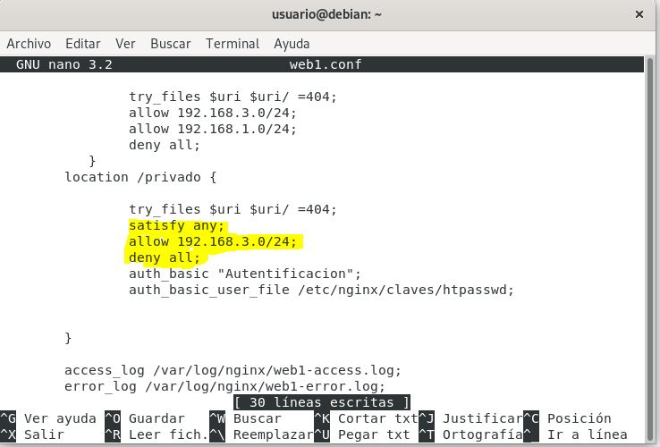

# NGINX
## Introducción
#### ¿ Que es Nginx ?
Es un servidor web/proxy inverso ligero de alto rendimiento y un proxy para protocolos de correo electrónico.Es software libre y de código abierto, licenciado bajo la Licencia BSD simplificada; también existe una versión comercial distribuida bajo el nombre de Nginx Plus.
## Indice
1. [Nginx vs Apache](#comparativa)
2. [Esquema de Red](#esquema)
3. [Instalacion](#instalacion)
4. [Casos practicos](#practicas)
5. [Referencias](#referencias)
<a name="comparativa"></a>
### 1. Nginx vs Apache

Nginx y Apache son servidores web populares usados para enviar páginas web al navegador del usuario. En nuestro caso, desde un sitio de WordPress con un host. Datos rápidos:

- Apache fue lanzado primero en 1995, luego llegó Nginx en el 2004.
- Ambos son usados por grandes compañías Fortune 500 alrededor del mundo.
- La posición de Nginx en el mercado ha ido en crecimiento constante en los últimos años.
- En algunas ocasiones, Nginx ha tenido la ventaja competitiva en términos de desempeño.
<a name="esquema"></a>
### 2. Esquema de Red
Este sera el esquema de red que vamos a usar para las practicas  
  
<a name="instalacion"></a>
### 3. Instalación
Ahora procederemos a instalar nginx.

```
$ apt update
```
```
$ apt install nginx
```
Comprobamos que el servicio esta funcionando.  
  

<a name="practicas"></a>
### 4. Casos Practicos
#### A. Versión de Nginx  

#### B. Servicio Asociado
El servicio es nginx.service  

#### C. Ficheros de Configuración
Los ficheros de configuración de nginx se encuentran en /etc/nginx y el fichero mas importante es nginx.conf  
  
#### D. Página Web por defecto  
Vamos a modificar la pagina web de nginx por defecto,los archivos web del servidor por defecto se encuentran en la ruta /var/www/html/.  
Editamos el fichero index.html.  
Así quedaría  
 
#### E. Virtual Hosting
Queremos que nuestro servidor web ofrezca dos sitios web, teniendo en cuenta lo siguiente:
Cada sitio web tendrá nombres distintos.
Cada sitio web compartirán la misma dirección IP y el mismo puerto (80).
Los dos sitios web tendrán las siguientes características:

1.- Creamos Directorios y damos los permisos.

```
$ sudo mkdir /var/www/html/web1
$ sudo mkdir /var/www/html/web2
$ chown -R www-data:www-data web1
$ chown -R www-data:www-data web2
```

2.- Creamos web.conf y el html para cada página y despues vemos como sale.

En web2.conf permitiremos que entren la red 192.168.1.0 y red 192.168.3.0.
```
server {
        listen 80;
        listen [::]:80;
        
        server_name www.web-1.org;

        root /var/www/web1;
        index index.html;

        location / {
                try_files $uri $uri/ =404;
                allow 192.168.3.0/24;
                allow 192.168.1.0/24;
                deny all;
        }

        access_log /var/log/nginx/web1.org-access.log;
        error_log /var/log/nginx/web1.org-error.log;
}
```
Salida:  


En web2.conf permitiremos que solo entre la red 192.168.3.0.
```
server {
        listen 80;
        listen [::]:80;

        server_name www.web-2.org;

        root /var/www/web2;
        index index.html;

        location / {
                try_files $uri $uri/ =404;
                allow 192.168.3.0/24;
                deny all;
        }

        access_log /var/log/nginx/web2.org-access.log;
        error_log /var/log/nginx/web2.org-error.log;
}
```

Salida:  
  

#### F. Autentificación, Autorización y Control de acceso ( Ejercicio 1)  
www.web-1.org se puede acceder desde la red externa y la red interna.  
www.web-2.org sólo se puede acceder desde la red interna.  

Para ello añadiremos las siguientes lineas a cada fichero .conf  

En web1.conf:  
  
En web2.conf:  
  

#### G. Autentificación, Autorización y Control de acceso  ( Ejercicio 2 )
En www.web1.org crearemos un directorio llamado privado.
Lo configuraremos para que solo puedan acceder usuarios válidos

1.- Creamos la carpeta "privado" en /var/www/web1/ y añadimos un index.html con el texto que queramos:
```
$ cd /var/www/web1
$ mkdir privado
```
2.- Dentro de /etc/nginx/claves creamos las credenciales:
```
$ htpasswd -c -m htpasswd usuario1
```
```
$ htpasswd -c -m htpasswd alejandro
```
3.-Editamos nuestro web1.conf añadiendo las siguientes lineas:  
  
4.- Finalmente comprobamos que podemos acceder con los usuarios
Acceso con el usuario alejandro:  
  
Vista de la página:  
  
#### H. Autentificación, Autorización y Control de acceso ( Ejercicio 3 )  
Desde la Red externa pide autenticacion al directorio privado,pero desde la red interna no.
1.- Modificamos el fichero web1.conf:  
  
2.- Comprobamos desde red externa:  
  
3.- Comprobamos desde red interna:  
  
